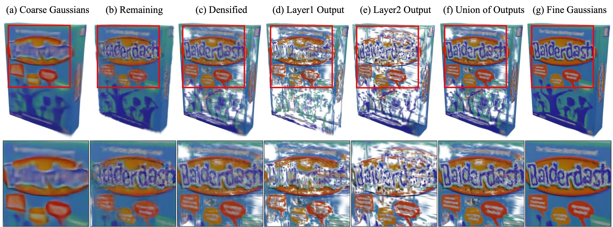

<p align="center">
  <h1 align="center">
  Generative Densification: Learning to Densify Gaussians <br> for High-Fidelity Generalizable 3D Reconstruction
  </h1>
  <p align="center">
    <a href="https://github.com/stnamjef">Seungtae Nam*</a>
    &nbsp;·&nbsp;
    <a href="https://scholar.google.com/citations?user=VLzxTrAAAAAJ&hl=ko&oi=ao">Xiangyu Sun*</a>
    &nbsp;·&nbsp;
    <a href="https://github.com/Gynjn">Gyeongjin Kang</a>
    &nbsp;·&nbsp;
    <a href="https://github.com/Younggeun-L">Younggeun Lee</a>
    &nbsp;·&nbsp;
    <a href="https://github.com/ohsngjun">Seungjun Oh</a>
    &nbsp;·&nbsp;
    <a href="https://silverbottlep.github.io/">Eunbyung Park</a>
  </p>
  <h3 align="center">
  <a href="https://arxiv.org/abs/2412.06234">Paper</a> | 
  <a href="https://stnamjef.github.io/GenerativeDensification/">Project Page</a> |
  <a href="https://huggingface.co/Xiang12yu/GDM-scene/tree/main">Checkpoints</a> 
  </h3>
  <div style="padding-top: 5px;"></div>
</p>

||
|:--:|
| **Our method selectively densifies coarse Gaussians generated by generalized feed-forward models.** |

## Installation
#### 1. Install Docker and NVIDIA Container Toolkit
* please follow the official [document](https://docs.nvidia.com/datacenter/cloud-native/container-toolkit/install-guide.html#docker) for installation.
* if you already installed both of them, please skip this part.

#### 2. Clone
```
git clone -b scene --single-branch https://github.com/stnamjef/GenerativeDensification.git --recursive
```

#### 3. Create Environment
* please prepare the datasets first following the [instructions](#datasets).
* then run below at `/your/path/to/GenerativeDensification` (notice the dot at the end).
```
docker build -t generative_densification_scene:0.0.1 .
docker run -it -v $(pwd):/workspace --ipc host --gpus all generative_densification_scene:0.0.1
```

#### 4. Install latent-gaussian-rasterization
* run below at `/workspace` inside the docker container.
```
pip3 install git+https://github.com/Chrixtar/latent-gaussian-rasterization.git
```

## Datasets
* Our scene-level model is trained on RealEstate10K training set, provided by [pixelSplat](https://github.com/dcharatan/pixelsplat?tab=readme-ov-file#acquiring-datasets).
* You can follow [pixelSplat instructions](https://github.com/dcharatan/pixelsplat?tab=readme-ov-file#acquiring-datasets) to download the ACID dataset, and the DTU dataset can be found in [here](https://github.com/donydchen/mvsplat?tab=readme-ov-file#dtu-for-testing-only).
* Note: 
  * We assume the datasets are in the `./GenerativeDensification/dataset`.

```shell
GenerativeDensification
├── config
├── dataset
│   ├── re10k
│   │   ├── test
│   │   │   ├── 000000.torch
│   │   │   ...
│   │   ...
│   ...
├── src
...
```

## Training
* Training on RealEstate10K dataset.
```
python -m src.main +experiment=re10k data_loader.train.batch_size=2
```
* Fine-tuning on RealEstate10K dataset from the checkpoint.
```
python -m src.main +experiment=re10k \
    data_loader.train.batch_size=2 \
    checkpointing.load=checkpoints/fast_model.ckpt \
    checkpointing.resume=false \
    trainer.max_steps=150_001
```

## Evaluation
* We provide two [checkpoints](https://huggingface.co/Xiang12yu/GDM-scene/tree/main) for our scene-level model.
* Note: 
  * The checkpoint 'fast_model.ckpt' is our scene-level model trained on RealEstate10K for 300K iterations.
  * The checkpoint 'final_model.ckpt' is the model further fine-tuned for addtional 150K iterations.
* Run the following command to evaluate the model on the RealEstate10K dataset.
* More cammands for cross-dataset evaluation can be found in the commands.sh file.
```
python -m src.main +experiment=re10k \
    checkpointing.load=checkpoints/final_model.ckpt \
    mode=test \
    dataset/view_sampler=evaluation \
    test.compute_scores=true \
    dataset.roots=[/dataset/re10k]
```

## Acknowledgements
Our work is built upon the following projects.
We thank all the authors for making their amazing works publicly available.
* [LaRa](https://github.com/autonomousvision/LaRa)
* [MVSplat](https://github.com/donydchen/mvsplat)
* [MVSplat360](https://github.com/donydchen/mvsplat360)
* [SplatterImage](https://github.com/szymanowiczs/splatter-image)
* [AbsGS](https://github.com/TY424/AbsGS)
* [diff-gaussian-rasterization](https://github.com/ashawkey/diff-gaussian-rasterization)

## Citation
```bibtex
@article{GenerativeDensification,
  title={Generative Densification: Learning to Densify Gaussians for High-Fidelity Generalizable 3D Reconstruction}, 
  author={Nam, Seungtae and Sun, Xiangyu and Kang, Gyeongjin and Lee, Younggeun and Oh, Seungjun and Park, Eunbyung},
  journal={arXiv preprint arXiv:2412.06234},
  year={2024}
}
```