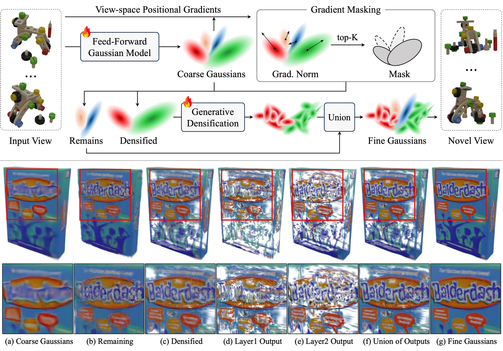

<p align="center">
  <h1 align="center">
  Generative Densification: Learning to Densify Gaussians <br> for High-Fidelity Generalizable 3D Reconstruction
  </h1>
  <h3 align="center">CVPR 2025 (Highlight)</h3>
  <p align="center">
    <a href="https://github.com/stnamjef">Seungtae Nam*</a>
    &nbsp;·&nbsp;
    <a href="https://scholar.google.com/citations?user=VLzxTrAAAAAJ&hl=ko&oi=ao">Xiangyu Sun*</a>
    &nbsp;·&nbsp;
    <a href="https://github.com/Gynjn">Gyeongjin Kang</a>
    &nbsp;·&nbsp;
    <a href="https://github.com/Younggeun-L">Younggeun Lee</a>
    &nbsp;·&nbsp;
    <a href="https://github.com/ohsngjun">Seungjun Oh</a>
    &nbsp;·&nbsp;
    <a href="https://silverbottlep.github.io/">Eunbyung Park</a>
  </p>
  <h3 align="center">
  <a href="https://arxiv.org/abs/2412.06234">Paper</a> | 
  <a href="https://stnamjef.github.io/GenerativeDensification/">Project Page</a> |
  <a href="https://huggingface.co/Xiang12yu/GDM-object/tree/main">Checkpoints</a> 
  </h3>
  <div style="padding-top: 5px;"></div>
</p>

||
|:--:|
| **Our method selectively densifies coarse Gaussians generated by generalized feed-forward models.** |

## Installation
#### 1. Install Docker and NVIDIA Container Toolkit
* please follow the official [document](https://docs.nvidia.com/datacenter/cloud-native/container-toolkit/install-guide.html#docker) for installation.
* if you already installed both of them, please skip this part.

#### 2. Clone
```
git clone https://github.com/stnamjef/GenerativeDensification.git --recursive
```

#### 3. Create Environment
* please prepare the datasets first following the [instructions](#datasets).
* then run below at `/your/path/to/GenerativeDensification` (notice the dot at the end).
```
docker build -t generative_densification:0.0.1 .
docker run -it -v $(pwd):/workspace --ipc host --gpus all generative_densification:0.0.1
```

#### 4. Install diff-gaussian-rasterization
* run below at `/workspace` inside the docker container.
```
pip3 install ./third_party/diff-gaussian-rasterization
```

## Datasets
* Our object-level model is trained on Gobjaverse training set, provided by [LaRa](https://github.com/autonomousvision/LaRa?tab=readme-ov-file#dataset).
* We do cross-dataset generalization on GSO and Co3D dataset. You can download our preprocessed Co3D dataset [here](https://huggingface.co/datasets/Xiang12yu/Co3D/tree/main).
* Note: 
  * The Gobjaverse dataset requires 1.4TB of storage.
  * We assume the datasets are in the `./GenerativeDensification/dataset`.

```shell
GenerativeDensification
├── dataLoader
├── dataset
│   ├── gobjaverse
│   │   ├── gobjaverse_part_01.h5
│   │   ...
│   │
│   ├── google_scanned_objects
│   │   ├── 2_of_Jenga_Classic_Game
│   │   ...
│   ...
├── lightning
...
```

## Training
* You can enable residual learning by setting `model.enable_residual_attribute=True`.
```
python train_lightning.py \
  train_dataset.data_root=./dataset/gobjaverse/gobjaverse.h5 \
  test_dataset.data_root=./dataset/gobjaverse/gobjaverse.h5 \
  model.enable_residual_attribute=False
```

## Evaluation
* We provide two [checkpoints](https://huggingface.co/Xiang12yu/GDM-object/tree/main) (w/ residual learning and w/o it) for our object-level models.
* Note: 
  * The checkpoint 'epoch=49.ckpt' corresponds to 'Ours' model in the paper.
  * The checkpoint 'epoch=49_residual.ckpt' corresponds to 'Ours (w/ residual)' model in the paper.
```
python eval_all.py
```

## Acknowledgements
Our work is built upon the following projects.
We thank all the authors for making their amazing works publicly available.
* [LaRa](https://github.com/autonomousvision/LaRa)
* [MVSplat](https://github.com/donydchen/mvsplat)
* [MVSplat360](https://github.com/donydchen/mvsplat360)
* [SplatterImage](https://github.com/szymanowiczs/splatter-image)
* [AbsGS](https://github.com/TY424/AbsGS)
* [diff-gaussian-rasterization](https://github.com/ashawkey/diff-gaussian-rasterization)

## Citation
```bibtex
@article{GenerativeDensification,
  title={Generative Densification: Learning to Densify Gaussians for High-Fidelity Generalizable 3D Reconstruction}, 
  author={Nam, Seungtae and Sun, Xiangyu and Kang, Gyeongjin and Lee, Younggeun and Oh, Seungjun and Park, Eunbyung},
  journal={arXiv preprint arXiv:2412.06234},
  year={2024}
}
```
